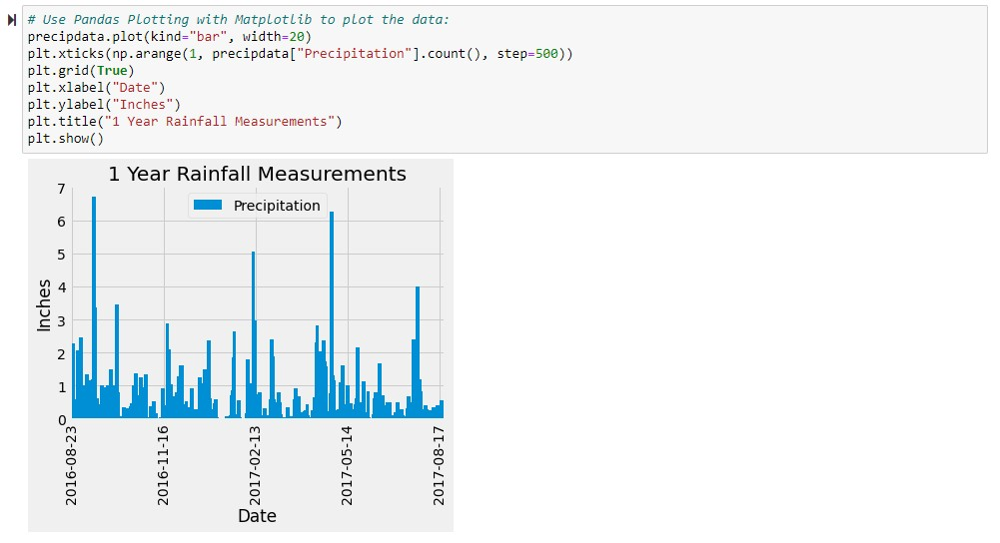
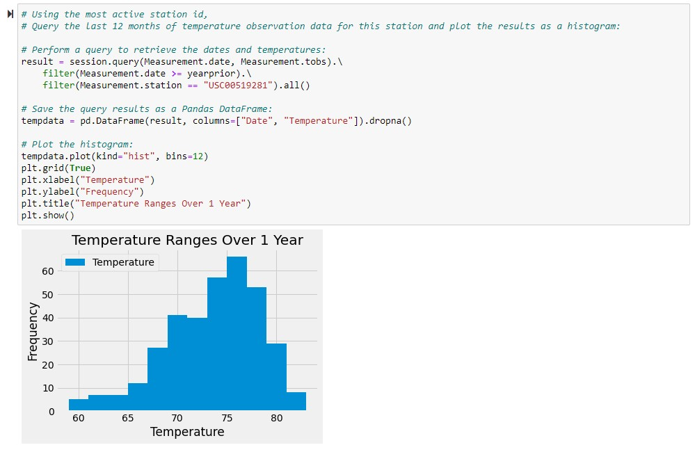
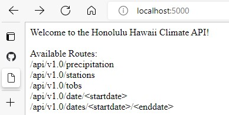
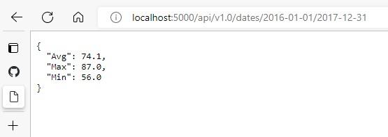

<h1> How's the Weather in Hawaii?   (Some SQLAlchemy Techniques to Programmatically Access Data in a SQL Database) </h1> 

#### Overview:

This project has two parts that each illustrate some ways to use SQLAlchemy in Python to access data from a SQLite database.  
The first part is a Jupyter notebook (climate.ipyng) that accesses the data within the database (hawaii.sqlite) and performs some minor analyses.  
The second part is a Flask application (app.py) that simulates an API to perform some basic analytical queries on the database.

(Note: To use the Flask app, run *"app.py"* and then point your browser to "localhost:5000".)  
(Also, dates must be in the form: YYYY-MM-DD.)

To examine or run the code files, their locations are indicated in the following tree:

#### Files/Folders:

+ **"Code"** (main folder)
	+ *"climate.ipynb"* (jupyter notebook analyzing weather data)  
	+ *"app.py"* (Flask app to enable user to interact with analysis)  
	+ **"Resources"** (data folder)  
		- *"hawaii.sqlite"* (database file needed by *"climate.ipynt"* and *"app.py"*)  

(Please do not move, rename, delete, or alter!)
	
#### Jupyter notebook showing rainfall for 1 year:
  

#### Jupyter notebook showing frequency of temperatures during 1 year:
  

#### Flask landing route:
  

#### Example of analysis output in Flask:
  
